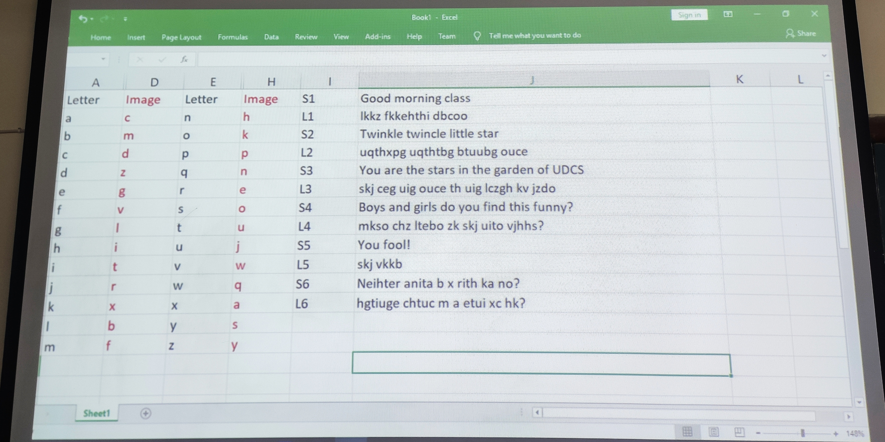

# Lerning curve analysis (Sentence mapping)

Objective of the assignment is to come up with an test to intuitively calculate **learning curve** of a person based on how much time it takes for a person to map a sentence according to a random set of alphabet image.

In the class we were given a set of alphabet images which was randomly generated using MS Excel. Then we were given some strings and were asked to map (*encode*) those with respect to the random image.
After the exercise we were asked to check for errors (if any) and check for ourselves how well did we do. A perfect answer meant a good learning curve.

*This was supposed to be done programatically as this week's assignment.*

### Algorithm

1. Ask user to input a string `orig_sentence`
2. Prompt user with another input `mapped_sentence`. This input will be the mapped sentence of the original sentence.
3. Start a timer to measure the time it took the user to input the *mapped string*.
4. Show both the original input sentence and the mapped sentence and calculate the accuracy by matching it with the `alphabet_image` list

### Program specifics

1. Used `string.ascii_lowercase` instead of manually creating a list of alphabets.
2. `random.shuffle()` is used randomize the *images* every time.
3. `*` is used while printing lists because `*list` will pass every element of the list to the `print()` instead of passing only one argument.
4. `fuzz` module is used to check the accuracy. Many other menthods are used to calculate the accuracy between two strings, but they are lengthy and inefficient.
